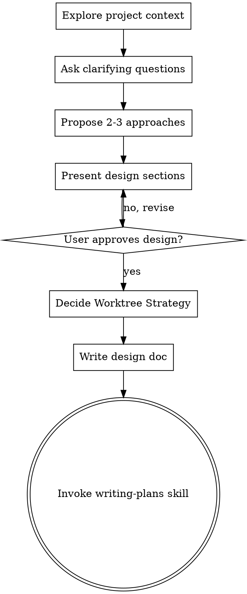

# Brainstorming Ideas Into Designs

## Overview

Help turn ideas into fully formed designs and specs through natural collaborative dialogue.

Start by understanding the current project context, then ask questions one at a time to refine the idea. Once you understand what you're building, present the design and get user approval.

<HARD-GATE>
Do NOT invoke any implementation skill, write any code, scaffold any project, or take any implementation action until you have presented a design and the user has approved it. This applies to EVERY project regardless of perceived simplicity.
</HARD-GATE>

## Anti-Pattern: "This Is Too Simple To Need A Design"

Every project goes through this process. A todo list, a single-function utility, a config change — all of them. "Simple" projects are where unexamined assumptions cause the most wasted work. The design can be short (a few sentences for truly simple projects), but you MUST present it and get approval.

## Checklist

You MUST create a task for each of these items and complete them in order:

1. **Explore project context** — check files, docs, recent commits
2. **Ask clarifying questions** — one at a time, understand purpose/constraints/success criteria
3. **Propose 2-3 approaches** — with trade-offs and your recommendation
4. **Present design** — in sections scaled to their complexity, get user approval after each section
5. **Decide Worktree Strategy** — apply heuristics below, record recommendation (advisory)
6. **Write design doc** — save to `docs/plans/YYYY-MM-DD-<topic>-design.md` and commit
7. **Transition to implementation** — invoke writing-plans skill to create implementation plan

## Process Flow



**The terminal state is invoking writing-plans.** Do NOT invoke any implementation skill (e.g. `fluxui-development`, `volt-development`, `pest-testing`, `laravel-best-practices`) directly from brainstorming. The ONLY skill you invoke after brainstorming is `writing-plans`. Implementation skills get pulled in by the plan itself.

## The Process

**Understanding the idea:**
- Check out the current project state first (files, docs, recent commits)
- Ask questions one at a time to refine the idea
- Prefer multiple choice questions when possible, but open-ended is fine too
- Only one question per message - if a topic needs more exploration, break it into multiple questions
- Focus on understanding: purpose, constraints, success criteria

**Exploring approaches:**
- Propose 2-3 different approaches with trade-offs
- Present options conversationally with your recommendation and reasoning
- Lead with your recommended option and explain why

**Presenting the design:**
- Once you believe you understand what you're building, present the design
- Scale each section to its complexity: a few sentences if straightforward, up to 200-300 words if nuanced
- Ask after each section whether it looks right so far
- Cover: architecture, components, data flow, error handling, testing
- Be ready to go back and clarify if something doesn't make sense

## Worktree Strategy (Advisory)

After the design is approved and before writing the design doc, evaluate whether the implementation should run in an isolated git worktree. **This is an advisory recommendation** — the user/agent can always override at execution time.

Score the design against these signals and pick the strongest applicable recommendation:

| Signal | Recommendation |
|---|---|
| Touches > ~5 files OR multiple subsystems | **Strongly recommend worktree** |
| Will run in parallel with other in-flight feature work | **Required worktree** |
| Risky / experimental / might be discarded | **Required worktree** (cheap discard via `git worktree remove`) |
| Long-running (multi-day) feature | **Required worktree** |
| Cross-cutting refactor | **Strongly recommend worktree** |
| New isolated module / package extraction | **Strongly recommend worktree** |
| Single small file edit, < 30 min | **Skip worktree** |
| Hotfix on the current branch | **Skip worktree** |
| Trivial config or doc change | **Skip worktree** |
| Time-sensitive fix where context-switch cost > isolation benefit | **Skip worktree, note in plan** |

**Output format** (record this in the design doc and the plan header):

```markdown
## Worktree Strategy

**Recommendation:** <Required | Strongly recommend | Skip>
**Reason:** <one-line explanation tied to a signal above>
**Suggested branch name:** `<feature/short-name>` (only if recommending)
```

If the recommendation is "Required" or "Strongly recommend", `writing-plans` will surface this in the plan header so the executor knows to invoke `using-git-worktrees` before starting Task 1.

## After the Design

**Documentation:**
- Write the validated design (including the Worktree Strategy block) to `docs/plans/YYYY-MM-DD-<topic>-design.md`
- Commit the design document to git (on the *current* branch — worktree creation, if any, happens later)

**Implementation:**
- Invoke the `writing-plans` skill to create a detailed implementation plan
- Pass forward: design doc path, worktree recommendation, suggested branch name
- Do NOT invoke any other skill. `writing-plans` is the next step.

## Key Principles

- **One question at a time** - Don't overwhelm with multiple questions
- **Multiple choice preferred** - Easier to answer than open-ended when possible
- **YAGNI ruthlessly** - Remove unnecessary features from all designs
- **Explore alternatives** - Always propose 2-3 approaches before settling
- **Incremental validation** - Present design, get approval before moving on
- **Be flexible** - Go back and clarify when something doesn't make sense
- **Worktree decision is advisory** - Make a recommendation; the plan execution honors it but the user can override
