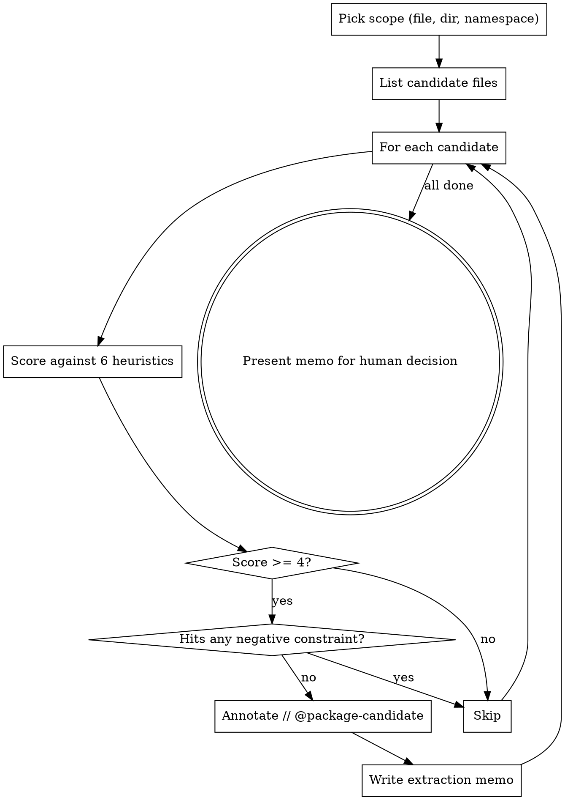

# Package Extraction Scout

## Overview

Architectural-gravity analysis: spot Laravel/PHP services that have outgrown the monolith and would benefit from being extracted into their own Composer package, **without** ripping them out yet. The output is an annotated candidate list and an extraction memo for human review — never an automatic move.

**Core principle:** Extract when the code has stopped changing and others want it; keep in the monolith when it's still in flux.

**Inverse of `removing-dead-files`:** that skill removes code with no life. This skill flags code with *too much* life — code that has matured into a library and is now slowing down the host app.

## When to Use

**Trigger this skill when:**

- Finishing a feature (the new code may itself be a candidate)
- During a refactor that touches `app/Services/`, `app/Support/`, `app/Integrations/`, or any utility namespace
- The same logic is being copy-pasted across modules or sibling repos
- A class has had no functional changes in 4+ weeks but the surrounding app keeps churning
- The user asks "should this be a package?" or mentions Satis, Packagist, or `composer require`
- After running `removing-dead-files` (clean up first, then look for extraction wins)

**Do NOT use when:**

- The codebase is < 6 months old (too early — let patterns stabilize)
- The candidate class was modified in the last 14 days (still in flux — extracting now causes double-commit overhead)
- The team is < 3 developers and there's no second consumer for the package (over-engineering)
- The "service" is really just business logic for this one app

## Extraction Heuristics

Score each candidate against these signals. The candidate qualifies when **at least 4 of 6** are true.

| # | Signal | How to check |
|---|---|---|
| 1 | **Zero `App\` coupling** | `rg "use App\\\\" path/to/Candidate.php` returns nothing. The class depends only on framework + interfaces + value objects, never on `App\Models\*`, `App\Http\*`, `App\Services\*`. |
| 2 | **Solves a utility problem** | PDF generation, custom encryption, specialized API wrapper, math/geometry, parsing — NOT order-fulfillment, billing rules, user onboarding (those are business logic). |
| 3 | **Stable public API** | `git log --oneline -- path/to/Candidate.php` shows no signature changes in the last 4+ weeks. Method names and parameter lists haven't moved. |
| 4 | **High internal cohesion / low external coupling** | Few imports out, many internal collaborators. The class would compile in isolation if you copied its directory + a few helpers. |
| 5 | **Reuse pressure exists** | The class (or a near-copy of it) appears in 2+ modules in this repo, OR is being requested by a sibling project, OR you've written it twice already. |
| 6 | **Specialized dependency surface** | Pulls in a dependency the rest of the app doesn't need (a niche API client, a math lib, a specific OAuth provider) — extracting moves that weight out of the host's `composer.json`. |

## Negative Constraints (Disqualify Outright)

If ANY of these are true, **do not flag the class** even if it scores 6/6:

- Modified within last 14 days (still in flux — extraction = double-commit pain)
- Depends on `App\Models\*` (Eloquent models = app-specific, not portable)
- Has a Filament Resource, Livewire component, or Volt component co-located (UI binding = belongs in app)
- Tied to a specific database schema controlled by the host app
- Has < 3 callers (extraction overhead exceeds benefit)
- The candidate is a job, listener, or mailable (these are framework glue, not libraries)

## The Process



### Step 1: Pick Scope

Default scope: `app/Services/`, `app/Support/`, `app/Integrations/`. Skip `app/Models/`, `app/Http/`, `app/Filament/`, `app/Livewire/`, `app/Console/Commands/`, `app/Jobs/`, `app/Listeners/`, `app/Mail/`, `app/Notifications/`.

User can override with a specific path or namespace.

### Step 2: List Candidate Files

```bash
# Files modified > 14 days ago (stability check, signal #3)
find app/Services app/Support app/Integrations -name '*.php' -mtime +14 2>/dev/null
```

### Step 3: Score Each Candidate

For each file, run the six checks. Don't guess — actually run the commands.

```bash
# Signal 1: App\ coupling
rg --count 'use App\\' path/to/Candidate.php

# Signal 3: API stability over last 4 weeks
git log --since='4 weeks ago' --oneline -- path/to/Candidate.php

# Signal 4: Inbound coupling (how many places use it)
rg --count "use .*\\\\$(basename $candidate .php);" app/

# Signal 5: Reuse pressure — look for similar class names or duplicate logic
rg -l "class .*$(basename $candidate .php)" .
```

Record the score (0–6) and which signals fired.

### Step 4: Apply Negative Constraints

Even high scorers get dropped if they fail negative constraints. Always run:

```bash
# Recent modification check
git log --since='14 days ago' --oneline -- path/to/Candidate.php

# Eloquent dependency check
rg 'use App\\Models\\' path/to/Candidate.php

# Caller count
rg -l "$(basename $candidate .php)" app/ | wc -l
```

### Step 5: Annotate (Non-Destructive)

For each surviving candidate, add a single comment at the top of the class. Do NOT modify any other code.

```php
<?php

namespace App\Services\Pdf;

// @package-candidate score=5/6 signals=1,2,3,4,6 last-changed=2026-03-12
// See docs/extraction-candidates.md for the extraction memo.
class InvoicePdfRenderer
{
    // ...
}
```

### Step 6: Write the Extraction Memo

Append (or create) `docs/extraction-candidates.md`:

```markdown
# Package Extraction Candidates

> Generated by `.agents/skills/package-extraction-scout/SKILL.md` on YYYY-MM-DD.
> These are recommendations only. Human decision required before any extraction.

---

## App\Services\Pdf\InvoicePdfRenderer

**Score:** 5/6
**Signals fired:** 1 (no App\ coupling), 2 (utility — PDF), 3 (stable since 2026-03-12), 4 (high cohesion), 6 (only consumer of `dompdf/dompdf`)
**Signal missing:** 5 (no second consumer yet)
**Last functional change:** 2026-03-12 (62 days ago)
**Inbound callers:** 4

### Why extract

- `dompdf/dompdf` is dragged into the main app's `composer.json` solely for this class
- Public API hasn't moved in 2 months — library-level maturity
- Sibling project `acme/billing-portal` reimplemented the same renderer

### Suggested package

- **Name:** `acme/invoice-pdf`
- **Dependencies to move:** `dompdf/dompdf: ^3.0`
- **ServiceProvider:** `Acme\InvoicePdf\InvoicePdfServiceProvider`
- **Public API:** `InvoicePdfRenderer::render(Invoice $invoice): string`
- **Bind via:** interface `InvoiceRenderer` so the host app stays decoupled

### Risks / Why NOT extract

- Only one external consumer right now — could be premature
- `Invoice` is currently `App\Models\Invoice`; the package would need to accept an interface or DTO instead

### Recommended next step

Defer until billing-portal actually imports it OR until a third use case appears. Re-evaluate in 30 days.
```

### Step 7: Present and Stop

Report to the user:

```
Scanned <N> files in <scope>. Found <K> candidates:

  ★ App\Services\Pdf\InvoicePdfRenderer (5/6)
  ★ App\Support\Slug\SlugGenerator (4/6)
    App\Services\Email\BulkSender (3/6 — below threshold)

Annotated <K> classes with `// @package-candidate`.
Memo written to docs/extraction-candidates.md.

Recommend reviewing the memo with your team before any extraction.
No code was extracted, moved, or refactored.
```

**Do not proceed to extraction without explicit human approval and a separate brainstorming + writing-plans cycle.** Extraction is a multi-day project, not a one-shot edit.

## What Extraction Looks Like (For Reference Only)

If a candidate is approved for extraction, the actual move is its own implementation plan. High-level shape:

1. Create new Composer package repo (`<vendor>/<name>`)
2. Move class, tests, dependencies into the package
3. Add `ServiceProvider` for Laravel auto-discovery
4. Publish via VCS or private Packagist/Satis
5. In host app: `composer require <vendor>/<name>` and remove the in-tree copy
6. Lock host app to specific package version

This is NOT this skill's job. This skill stops at the memo.

## Common Mistakes

| Mistake | Fix |
|---|---|
| Extracting business logic because it "looks generic" | Re-check signal 2. Order/billing/user logic is never a package. |
| Flagging a class modified yesterday | Re-check the negative constraint. 14-day cooldown is non-negotiable. |
| Auto-creating the package | This skill writes a memo. Period. Extraction needs `brainstorming` + `writing-plans`. |
| Bundling multiple candidates into one package | Each candidate gets its own memo entry. Decide grouping later, with humans. |
| Scoring without running commands | Guessing signal 3 (stability) without `git log` produces false positives. |
| Recommending extraction with < 3 callers | YAGNI. The overhead of a separate repo, CI, and version pinning needs justified reuse. |

## Red Flags — STOP

- About to delete or move the candidate file → STOP. This skill annotates only.
- About to edit `composer.json` → STOP. Extraction is a separate project.
- Recommending extraction of a Filament/Livewire/Volt class → STOP. UI bindings disqualify.
- Recommending extraction of an Eloquent model → STOP. Models are app-specific.
- Score = 6/6 but candidate was modified 3 days ago → STOP. Negative constraint wins.

## Integration

**Pairs with:**

- **`removing-dead-files`** — run that first to clean up, then this to find extraction wins
- **`brainstorming`** + **`writing-plans`** — required for actual extraction work, not for this scouting pass

**Does not require:**

- A worktree (this is a read-only scan + memo write; no code moves)

## Real-World Impact

When extraction is correctly identified:

- **Faster CI/CD** — heavy stable code stops running through the host app's test suite
- **Versioned stability** — host app pins a version, can experiment in the package repo without breaking production
- **Team autonomy** — sub-team owns the package lifecycle independently
- **Composer.json hygiene** — niche dependencies leave the main app

When extraction is incorrectly identified:

- Double-commit overhead (every change needs a package release + host bump)
- Lock-in to a premature API
- Over-engineered tooling for code that's still finding its shape

The negative constraints exist to prevent the second outcome.
