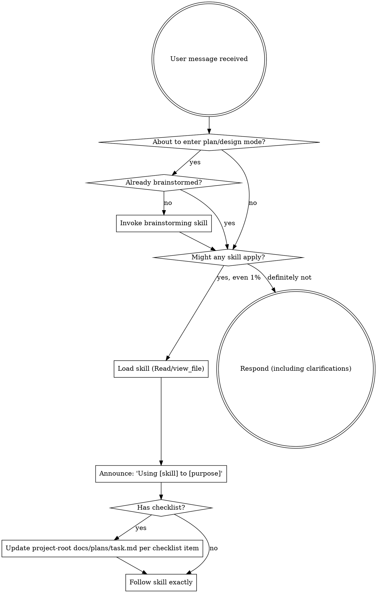

<EXTREMELY-IMPORTANT>
If you think there is even a 1% chance a skill might apply to what you are doing, you ABSOLUTELY MUST invoke the skill.

IF A SKILL APPLIES TO YOUR TASK, YOU DO NOT HAVE A CHOICE. YOU MUST USE IT.

This is not negotiable. This is not optional. You cannot rationalize your way out of this.
</EXTREMELY-IMPORTANT>

## How to Access Skills

Skills installed by this package live at `.agents/skills/<skill-name>/SKILL.md` in the project root. Load them with whatever file-read tool your runtime exposes (`Read`, `view_file`, `cat`, etc.) and follow the contents directly.

Some runtimes also support a global skill location (e.g. `~/.gemini/skills/<skill-name>/SKILL.md` for Gemini, `~/.claude/skills/...` for Claude Code). Project-local always wins on naming collisions.

# Using Skills

## The Rule

**Invoke relevant or requested skills BEFORE any response or action.** Even a 1% chance a skill might apply means that you should invoke the skill to check. If an invoked skill turns out to be wrong for the situation, you don't need to use it.

If the tracker file is missing, create `<project-root>/docs/plans/task.md` as a table-only task list.

## Red Flags

These thoughts mean STOP—you're rationalizing:

| Thought | Reality |
|---------|---------|
| "This is just a simple question" | Questions are tasks. Check for skills. |
| "I need more context first" | Skill check comes BEFORE clarifying questions. |
| "Let me explore the codebase first" | Skills tell you HOW to explore. Check first. |
| "I can check git/files quickly" | Files lack conversation context. Check for skills. |
| "Let me gather information first" | Skills tell you HOW to gather information. |
| "This doesn't need a formal skill" | If a skill exists, use it. |
| "I remember this skill" | Skills evolve. Read current version. |
| "This doesn't count as a task" | Action = task. Check for skills. |
| "The skill is overkill" | Simple things become complex. Use it. |
| "I'll just do this one thing first" | Check BEFORE doing anything. |
| "This feels productive" | Undisciplined action wastes time. Skills prevent this. |
| "I know what that means" | Knowing the concept ≠ using the skill. Invoke it. |

## Skill Priority

When multiple skills could apply, use this order:

1. **Process skills first** (`brainstorming`, `systematic-debugging`, `writing-plans`) - these determine HOW to approach the task
2. **Implementation skills second** (`fluxui-development`, `volt-development`, `tailwindcss-development`, `laravel-best-practices`, `pest-testing`, `blueprint-code-review`) - these guide execution
3. **Closeout skills last** (`verification-before-completion`, `requesting-code-review`, `finishing-a-development-branch`, `git-push`)

"Let's build X" → `brainstorming` first, then `writing-plans`, then implementation skills.
"Fix this bug" → `systematic-debugging` first, then domain-specific skills, then `verification-before-completion`.

## Skill Types

**Rigid** (TDD, debugging): Follow exactly. Don't adapt away discipline.

**Flexible** (patterns): Adapt principles to context.

The skill itself tells you which.

## User Instructions

Instructions say WHAT, not HOW. "Add X" or "Fix Y" doesn't mean skip workflows.
